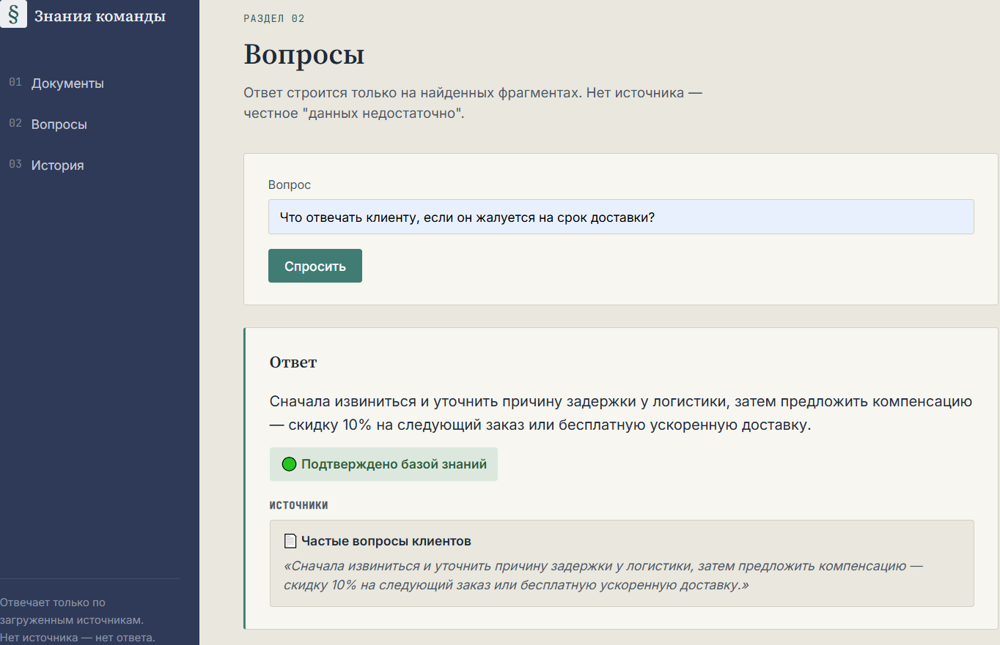
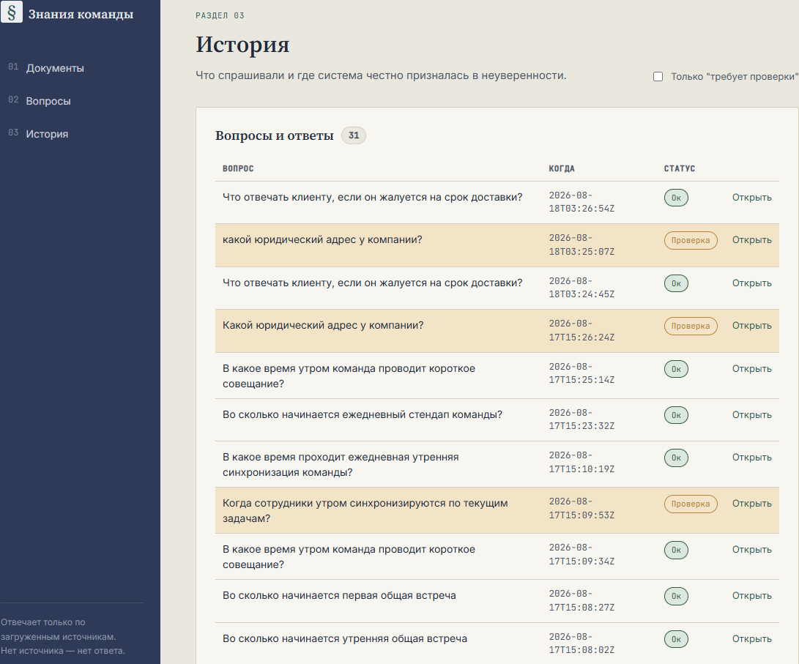

# Знания команды — Team Knowledge System

[](https://github.com/KirillTomenko/knowledge-system/actions/workflows/ci.yml)

**🔗 Живое демо: [knowledge-system-ln80.onrender.com](https://knowledge-system-ln80.onrender.com)**
_(бесплатный тариф — первый запрос после паузы может занять 30–50 секунд, сервис «просыпается»)_

> **English summary:** A web service that answers questions **only** from
> uploaded team documents — every answer either cites its source snippet
> or honestly says "not enough data" instead of guessing. Hybrid search
> (BM25 keyword + ChromaDB vector), strict-JSON AI operation with a
> confidence threshold, full request audit trail, and a reproducible
> Docker setup. Full documentation below is in Russian (built as a course
> capstone project for a Russian-speaking audience); the code, API, and
> architecture are language-agnostic.

Веб-сервис, который отвечает на вопросы **только** на основе загруженных
документов команды, всегда прикладывает цитаты-источники и честно
говорит «данных недостаточно», когда подходящего фрагмента нет — вместо
того, чтобы придумывать ответ.

## Скриншоты

| Ответ с источником | История и аудит |
|---|---|
|  |  |

## Ценность

- Экономия времени на поиск и онбординг новых сотрудников.
- Единая точка правды: документы + история вопросов.
- Доказуемость: каждый ответ сопровождается цитатами и записью в аудите.

## Архитектура

```
Веб-панель (документы / вопросы / история)
        │
        ▼
FastAPI — 3 точки доступа (POST /kb/documents, GET /kb/documents, POST /kb/ask)
        │
        ▼
Гибридный поиск: BM25 (ключевые слова) + ChromaDB (векторный), merge по RRF
        │
        ▼
LLM-операция: строгий JSON {answer, confidence, sources, needs_review, review_reason}
        │
        ▼
SQLite: documents, snippets, qa_runs, audit_runs
```

Поиск специально гибридный: ключевые слова ловят точные термины и коды,
которые часто есть во внутренних документах, векторный поиск ловит
перефразированные вопросы. Если векторный бэкенд недоступен (нет ключа,
сеть недоступна) — система не падает, а автоматически откатывается на
поиск по ключевым словам.

## Быстрый запуск (≤ 10 минут)

### Вариант 1 — Docker (рекомендуется)

```bash
git clone <ссылка на репозиторий>
cd knowledge-system
cp .env.example .env
# впишите OPENAI_API_KEY в .env
docker compose up --build
```

Панель будет доступна на `http://localhost:8000`.

### Вариант 2 — локально без Docker

```bash
python3 -m venv venv
source venv/bin/activate  # Windows: venv\Scripts\activate
pip install -r requirements.txt
cp .env.example .env
# впишите OPENAI_API_KEY в .env
uvicorn app.main:app --reload
```

## Переменные окружения (`.env`)

| Переменная | Назначение | По умолчанию |
|---|---|---|
| `OPENAI_API_KEY` | ключ доступа к OpenAI-совместимому API | — (обязательно) |
| `OPENAI_BASE_URL` | базовый URL провайдера (например, ProxyAPI) | `https://api.proxyapi.ru/openai/v1` |
| `OPENAI_MODEL` | модель для генерации ответа | `gpt-4o-mini` |
| `CONFIDENCE_THRESHOLD` | порог уверенности, ниже которого включается ручная проверка | `0.55` |
| `TOP_K` | сколько фрагментов брать при поиске | `5` |
| `DATABASE_PATH` | путь к SQLite-файлу | `./data/knowledge.db` |
| `CHROMA_PATH` | путь к хранилищу ChromaDB | `./data/chroma` |

## Примеры запросов (curl)

Добавить документ:
```bash
curl -X POST http://localhost:8000/kb/documents \
  -H "Content-Type: application/json" \
  -d '{"title": "Правила работы команды", "text": "Рабочие часы — с 10:00 до 19:00.\n\nОтпуск согласуется за 2 недели."}'
```

Посмотреть витрину документов:
```bash
curl http://localhost:8000/kb/documents
```

Задать вопрос базе знаний:
```bash
curl -X POST http://localhost:8000/kb/ask \
  -H "Content-Type: application/json" \
  -d '{"question": "Во сколько начинается рабочий день?"}'
```

> **Windows / PowerShell:** команды выше написаны в Bash-синтаксисе и не заработают как есть в PowerShell —
> `curl` там алиас на `Invoke-WebRequest`, а перенос строки через `\` не поддерживается.
> Рабочий вариант в PowerShell — вызывать `curl.exe` явно, JSON передавать через файл:
> ```powershell
> # demo_question.json: {"question": "Во сколько начинается рабочий день?"}
> curl.exe -X POST http://localhost:8000/kb/ask -H "Content-Type: application/json" --data "@demo_question.json"
> ```

## Где лежат данные и аудит

- SQLite-файл: `./data/knowledge.db` (открывается любым SQLite-клиентом, например DB Browser for SQLite).
- Таблица `audit_runs` — фиксирует каждый вызов всех трёх точек доступа (action, вход, выход, статус, ошибка, длительность).
- Таблица `qa_runs` — история вопросов и ответов, видна на экране «История» в панели.
- Векторный индекс ChromaDB: `./data/chroma` (пересобирается автоматически из snippets при каждом старте приложения).

## Как воспроизвести «ручную проверку»

Задайте вопрос, ответа на который точно нет в тестовых документах, например:
```bash
curl -X POST http://localhost:8000/kb/ask \
  -H "Content-Type: application/json" \
  -d '{"question": "Какой юридический адрес у компании?"}'
```
В ответе `needs_review` будет `true`, `sources` — пустой массив, `answer` — честное
«данных недостаточно». Запись появится в разделе «История» с пометкой «Требует проверки».

## Тестовые данные

- `tests_data/kb_documents.jsonl` — 5 документов (Правила работы команды, Частые
  вопросы клиентов, Шаблоны ответов, Словарь терминов, Процесс запуска задачи).
- `tests_data/kb_questions.jsonl` — 10 вопросов.

Чтобы загрузить тестовые документы одной командой:
```bash
python3 -c "
import json, requests
for line in open('tests_data/kb_documents.jsonl', encoding='utf-8'):
    doc = json.loads(line)
    requests.post('http://localhost:8000/kb/documents', json=doc)
print('Готово')
"
```

### Таблица вопросов и ожидаемого поведения

| № | Вопрос | Ожидается needs_review | Почему | Документ-источник |
|---|---|---|---|---|
| 1 | Во сколько начинается ежедневный стендап команды? | false | Указано напрямую | Правила работы команды |
| 2 | Сколько дней занимает стандартное внедрение продукта? | false | Указано напрямую | Частые вопросы клиентов |
| 3 | Что отвечать клиенту, если он жалуется на срок доставки? | false | Есть готовый шаблон и ответ в FAQ | Шаблоны ответов / FAQ |
| 4 | Что такое SLA? | false | Есть определение | Словарь терминов |
| 5 | По каким дням обычно происходит релиз изменений? | false | Указано в шаге 8 процесса | Процесс запуска задачи |
| 6 | За сколько дней согласовывать отпуск? | false | Указано напрямую | Правила работы команды |
| 7 | Работает ли поддержка по выходным? | false | Указано напрямую | Частые вопросы клиентов |
| 8 | Какая зарплата у менеджера по продажам? | true | Такой информации нет в базе | — |
| 9 | Как настроить VPN для доступа к продакшену? | true | Тема упомянута, инструкции нет | — |
| 10 | Какой юридический адрес у компании? | true | Не входит ни в один документ | — |

## Мини-экономика

- Ручной поиск ответа в разрозненных документах/чатах: ~15–30 минут на вопрос.
- Через систему: ~1–2 минуты (запрос + чтение ответа с источниками).
- На 100 вопросов в месяц: экономия ~20–45 часов рабочего времени команды
  против стоимости токенов LLM (для `gpt-4o-mini` — доли доллара на 100 запросов).
- Ценность растёт с размером команды и текучкой: онбординг новичков не требует
  постоянных вопросов "старожилам".

## Риски и меры снижения

1. **Модель придумывает ответ без источника** → строгая серверная валидация:
   если `sources` пустой, `needs_review` принудительно `true`, независимо от того,
   что вернула модель.
2. **Векторный поиск недоступен (нет сети/ключа)** → автоматический откат на
   BM25-поиск по ключевым словам, приложение не падает.
3. **Утечка секретов в репозиторий** → `.env` в `.gitignore`, в репозитории только `.env.example`.
4. **Слишком длинный документ ломает контекст модели** → ограничение на длину
   текста документа (`max_length=20000`) на уровне Pydantic-схемы.
5. **Модель возвращает невалидный JSON** → вызов оборачивается в try/except,
   ошибка попадает в `audit_runs` со статусом `error`, пользователю — честный
   ответ "данных недостаточно" вместо падения сервиса.
6. **Ложные источники (несуществующий snippet_id)** → сервер отфильтровывает
   источники, которых не было среди переданных модели фрагментов.

## План внедрения за 1 день

1. Поднять контейнер на внутреннем сервере (`docker compose up -d`).
2. Загрузить существующие документы команды (регламенты, FAQ, шаблоны).
3. Дать доступ команде к веб-панели, показать раздел «История» с фильтром
   «Требует проверки» — это и есть очередь на дополнение базы знаний.
4. Договориться, кто раз в неделю просматривает «Требует проверки» и
   добавляет недостающие документы.

## План развития

- Права доступа и разделение по командам/проектам.
- Автоматическое уведомление ответственного при накоплении N вопросов
  с одинаковой темой в `needs_review`.
- Версионирование документов вместо перезаписи.
- Экспорт истории вопросов в CSV/JSON прямо из панели.
